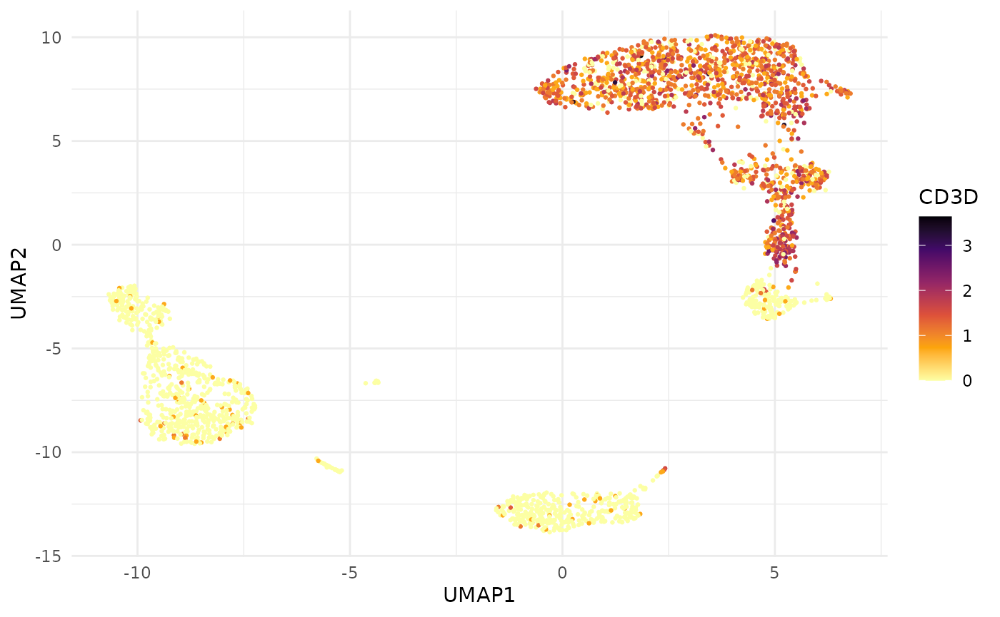
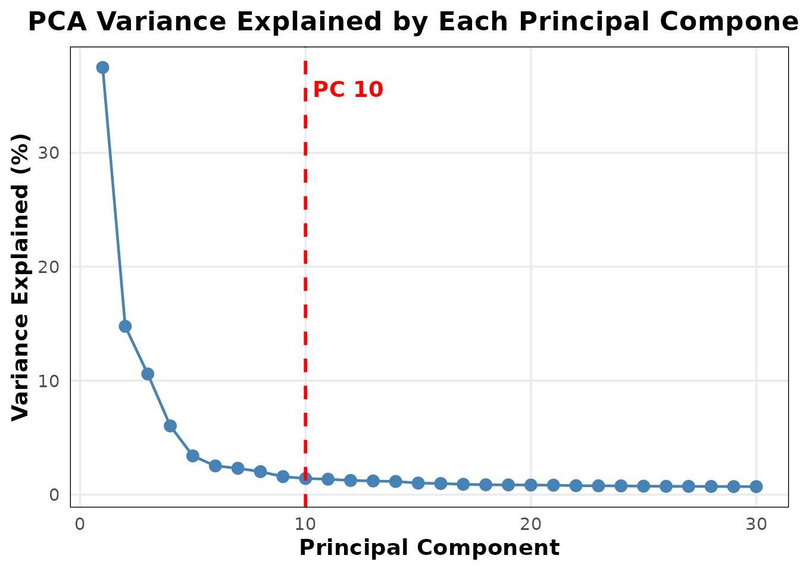
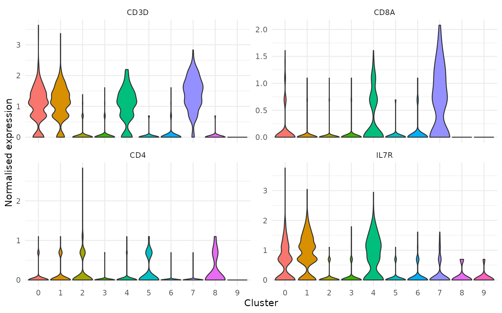

# Tidy Data Extraction from Seurat Objects

## Motivation

Seurat’s
[`FetchData()`](https://satijalab.github.io/seurat-object/reference/FetchData.html)
is the standard way to pull data out of a Seurat object for custom
plotting or downstream analysis. It works, but has a few rough edges:

- Returns a `data.frame` with cell barcodes as **rownames**, not a
  column
- Mixes expression data, embeddings, and metadata into one flat call
- No control over which layer (counts vs normalised) to extract
- Returns wide format for features, which requires manual pivoting for
  tidy workflows

BadranSeq provides two focused alternatives:

| Function | Returns | Use case |
|----|----|----|
| [`fetch_cell_data()`](https://wolf5996.github.io/BadranSeq/reference/fetch_cell_data.md) | One row per cell | Metadata, embeddings — no expression |
| [`fetch_feature_data()`](https://wolf5996.github.io/BadranSeq/reference/fetch_feature_data.md) | One row per cell × feature | Expression data + optional metadata/embeddings |

Both return tibbles with `cell_id` as an explicit column.

## The FetchData problem

Here is what
[`Seurat::FetchData()`](https://satijalab.github.io/seurat-object/reference/FetchData.html)
returns for a simple request — UMAP coordinates plus a gene:

``` r

head(Seurat::FetchData(pbmc3k, vars = c("umap_1", "umap_2", "CD3D")))
```

    ##                   umap_1     umap_2      CD3D
    ## AAACATACAACCAC  4.210592   3.641463 1.6094379
    ## AAACATTGAGCTAC  1.630015 -12.747495 0.0000000
    ## AAACATTGATCAGC  4.907857   6.225690 2.1972246
    ## AAACCGTGCTTCCG -9.577241  -5.631025 0.0000000
    ## AAACCGTGTATGCG  4.862227  -3.565488 0.0000000
    ## AAACGCACTGGTAC  5.625649   7.294040 0.6931472

Cell barcodes are trapped in rownames. Expression and embeddings are
mingled. There is no way to request a specific layer.

Compare with BadranSeq’s approach — embeddings and expression are
requested through separate, explicit arguments:

``` r

fetch_feature_data(
  pbmc3k,
  features = "CD3D",
  layer = "data",
  reductions = "umap",
  metadata = FALSE
)
```

    ## # A tibble: 2,700 × 5
    ##    cell_id        features  data UMAP1  UMAP2
    ##    <chr>          <fct>    <dbl> <dbl>  <dbl>
    ##  1 AAACATACAACCAC CD3D     1.61   4.21   3.64
    ##  2 AAACATTGAGCTAC CD3D     0      1.63 -12.7 
    ##  3 AAACATTGATCAGC CD3D     2.20   4.91   6.23
    ##  4 AAACCGTGCTTCCG CD3D     0     -9.58  -5.63
    ##  5 AAACCGTGTATGCG CD3D     0      4.86  -3.57
    ##  6 AAACGCACTGGTAC CD3D     0.693  5.63   7.29
    ##  7 AAACGCTGACCAGT CD3D     1.10   5.53   3.74
    ##  8 AAACGCTGGTTCTT CD3D     1.39   5.47   3.79
    ##  9 AAACGCTGTAGCCA CD3D     1.10  -1.51 -12.6 
    ## 10 AAACGCTGTTTCTG CD3D     0     -9.39  -2.97
    ## # ℹ 2,690 more rows

`cell_id` is a column. The feature name is explicit. The layer is
explicit. The output is a tibble ready for `ggplot2` or `dplyr`
pipelines.

## Cell-level data

[`fetch_cell_data()`](https://wolf5996.github.io/BadranSeq/reference/fetch_cell_data.md)
extracts metadata and embeddings — no expression data. This is the right
tool when you need cell annotations for plotting or filtering.

### All metadata (default)

``` r

fetch_cell_data(pbmc3k)
```

    ## # A tibble: 2,700 × 9
    ##    cell_id      orig.ident nCount_RNA nFeature_RNA seurat_annotations nCount_SCT
    ##    <chr>        <fct>           <dbl>        <int> <fct>                   <dbl>
    ##  1 AAACATACAAC… pbmc3k           2419          779 Memory CD4 T             2275
    ##  2 AAACATTGAGC… pbmc3k           4903         1352 B                        2598
    ##  3 AAACATTGATC… pbmc3k           3147         1129 Memory CD4 T             2469
    ##  4 AAACCGTGCTT… pbmc3k           2639          960 CD14+ Mono               2343
    ##  5 AAACCGTGTAT… pbmc3k            980          521 NK                       1900
    ##  6 AAACGCACTGG… pbmc3k           2163          781 Memory CD4 T             2149
    ##  7 AAACGCTGACC… pbmc3k           2175          782 CD8 T                    2158
    ##  8 AAACGCTGGTT… pbmc3k           2260          790 CD8 T                    2204
    ##  9 AAACGCTGTAG… pbmc3k           1275          532 Naive CD4 T              1905
    ## 10 AAACGCTGTTT… pbmc3k           1103          550 FCGR3A+ Mono             1980
    ## # ℹ 2,690 more rows
    ## # ℹ 3 more variables: nFeature_SCT <int>, SCT_snn_res.0.5 <fct>,
    ## #   seurat_clusters <fct>

### Add UMAP coordinates

``` r

fetch_cell_data(pbmc3k, reductions = "umap")
```

    ## # A tibble: 2,700 × 11
    ##    cell_id    UMAP1  UMAP2 orig.ident nCount_RNA nFeature_RNA seurat_annotations
    ##    <chr>      <dbl>  <dbl> <fct>           <dbl>        <int> <fct>             
    ##  1 AAACATACA…  4.21   3.64 pbmc3k           2419          779 Memory CD4 T      
    ##  2 AAACATTGA…  1.63 -12.7  pbmc3k           4903         1352 B                 
    ##  3 AAACATTGA…  4.91   6.23 pbmc3k           3147         1129 Memory CD4 T      
    ##  4 AAACCGTGC… -9.58  -5.63 pbmc3k           2639          960 CD14+ Mono        
    ##  5 AAACCGTGT…  4.86  -3.57 pbmc3k            980          521 NK                
    ##  6 AAACGCACT…  5.63   7.29 pbmc3k           2163          781 Memory CD4 T      
    ##  7 AAACGCTGA…  5.53   3.74 pbmc3k           2175          782 CD8 T             
    ##  8 AAACGCTGG…  5.47   3.79 pbmc3k           2260          790 CD8 T             
    ##  9 AAACGCTGT… -1.51 -12.6  pbmc3k           1275          532 Naive CD4 T       
    ## 10 AAACGCTGT… -9.39  -2.97 pbmc3k           1103          550 FCGR3A+ Mono      
    ## # ℹ 2,690 more rows
    ## # ℹ 4 more variables: nCount_SCT <dbl>, nFeature_SCT <int>,
    ## #   SCT_snn_res.0.5 <fct>, seurat_clusters <fct>

### Select specific metadata columns

``` r

fetch_cell_data(
  pbmc3k,
  reductions = "umap",
  metadata = c("seurat_clusters", "nFeature_RNA")
)
```

    ## # A tibble: 2,700 × 5
    ##    cell_id        UMAP1  UMAP2 seurat_clusters nFeature_RNA
    ##    <chr>          <dbl>  <dbl> <fct>                  <int>
    ##  1 AAACATACAACCAC  4.21   3.64 4                        779
    ##  2 AAACATTGAGCTAC  1.63 -12.7  3                       1352
    ##  3 AAACATTGATCAGC  4.91   6.23 1                       1129
    ##  4 AAACCGTGCTTCCG -9.58  -5.63 2                        960
    ##  5 AAACCGTGTATGCG  4.86  -3.57 6                        521
    ##  6 AAACGCACTGGTAC  5.63   7.29 1                        781
    ##  7 AAACGCTGACCAGT  5.53   3.74 4                        782
    ##  8 AAACGCTGGTTCTT  5.47   3.79 4                        790
    ##  9 AAACGCTGTAGCCA -1.51 -12.6  4                        532
    ## 10 AAACGCTGTTTCTG -9.39  -2.97 5                        550
    ## # ℹ 2,690 more rows

### Embeddings only (no metadata)

``` r

fetch_cell_data(pbmc3k, reductions = c("pca", "umap"), metadata = FALSE)
```

    ## # A tibble: 2,700 × 5
    ##    cell_id           PC1     PC2 UMAP1  UMAP2
    ##    <chr>           <dbl>   <dbl> <dbl>  <dbl>
    ##  1 AAACATACAACCAC  10.3   -1.10   4.21   3.64
    ##  2 AAACATTGAGCTAC   5.85  11.3    1.63 -12.7 
    ##  3 AAACATTGATCAGC   8.58  -1.68   4.91   6.23
    ##  4 AAACCGTGCTTCCG -25.6    1.71  -9.58  -5.63
    ##  5 AAACCGTGTATGCG   2.52 -21.2    4.86  -3.57
    ##  6 AAACGCACTGGTAC   6.59   0.621  5.63   7.29
    ##  7 AAACGCTGACCAGT  10.1   -4.35   5.53   3.74
    ##  8 AAACGCTGGTTCTT   9.71  -3.63   5.47   3.79
    ##  9 AAACGCTGTAGCCA   7.34   1.02  -1.51 -12.6 
    ## 10 AAACGCTGTTTCTG -18.4   -3.72  -9.39  -2.97
    ## # ℹ 2,690 more rows

## Feature expression data

[`fetch_feature_data()`](https://wolf5996.github.io/BadranSeq/reference/fetch_feature_data.md)
returns one row per cell per feature in long format. Expression values
are columns named after the requested layers.

### Single gene, normalised expression

``` r

fetch_feature_data(pbmc3k, features = "CD3D")
```

    ## # A tibble: 2,700 × 11
    ##    cell_id  features  data orig.ident nCount_RNA nFeature_RNA seurat_annotations
    ##    <chr>    <fct>    <dbl> <fct>           <dbl>        <int> <fct>             
    ##  1 AAACATA… CD3D     1.61  pbmc3k           2419          779 Memory CD4 T      
    ##  2 AAACATT… CD3D     0     pbmc3k           4903         1352 B                 
    ##  3 AAACATT… CD3D     2.20  pbmc3k           3147         1129 Memory CD4 T      
    ##  4 AAACCGT… CD3D     0     pbmc3k           2639          960 CD14+ Mono        
    ##  5 AAACCGT… CD3D     0     pbmc3k            980          521 NK                
    ##  6 AAACGCA… CD3D     0.693 pbmc3k           2163          781 Memory CD4 T      
    ##  7 AAACGCT… CD3D     1.10  pbmc3k           2175          782 CD8 T             
    ##  8 AAACGCT… CD3D     1.39  pbmc3k           2260          790 CD8 T             
    ##  9 AAACGCT… CD3D     1.10  pbmc3k           1275          532 Naive CD4 T       
    ## 10 AAACGCT… CD3D     0     pbmc3k           1103          550 FCGR3A+ Mono      
    ## # ℹ 2,690 more rows
    ## # ℹ 4 more variables: nCount_SCT <dbl>, nFeature_SCT <int>,
    ## #   SCT_snn_res.0.5 <fct>, seurat_clusters <fct>

### Multiple genes

The `features` column is a factor preserving your input order — useful
for controlling facet ordering in plots:

``` r

fetch_feature_data(
  pbmc3k,
  features = c("CD3D", "CD8A", "CD14", "MS4A1"),
  metadata = "seurat_clusters"
)
```

    ## # A tibble: 10,800 × 4
    ##    cell_id        features  data seurat_clusters
    ##    <chr>          <fct>    <dbl> <fct>          
    ##  1 AAACATACAACCAC CD3D     1.61  4              
    ##  2 AAACATACAACCAC CD8A     0.693 4              
    ##  3 AAACATACAACCAC CD14     0     4              
    ##  4 AAACATACAACCAC MS4A1    0     4              
    ##  5 AAACATTGAGCTAC CD3D     0     3              
    ##  6 AAACATTGAGCTAC CD8A     0     3              
    ##  7 AAACATTGAGCTAC CD14     0     3              
    ##  8 AAACATTGAGCTAC MS4A1    1.61  3              
    ##  9 AAACATTGATCAGC CD3D     2.20  1              
    ## 10 AAACATTGATCAGC CD8A     0     1              
    ## # ℹ 10,790 more rows

### Multiple layers side-by-side

Request both raw counts and normalised data. Each layer becomes its own
column:

``` r

fetch_feature_data(
  pbmc3k,
  features = "CD3D",
  layer = c("counts", "data"),
  metadata = FALSE
)
```

    ## # A tibble: 2,700 × 4
    ##    cell_id        features counts  data
    ##    <chr>          <fct>     <dbl> <dbl>
    ##  1 AAACATACAACCAC CD3D          4 1.61 
    ##  2 AAACATTGAGCTAC CD3D          0 0    
    ##  3 AAACATTGATCAGC CD3D          8 2.20 
    ##  4 AAACCGTGCTTCCG CD3D          0 0    
    ##  5 AAACCGTGTATGCG CD3D          0 0    
    ##  6 AAACGCACTGGTAC CD3D          1 0.693
    ##  7 AAACGCTGACCAGT CD3D          2 1.10 
    ##  8 AAACGCTGGTTCTT CD3D          3 1.39 
    ##  9 AAACGCTGTAGCCA CD3D          2 1.10 
    ## 10 AAACGCTGTTTCTG CD3D          0 0    
    ## # ℹ 2,690 more rows

### With embeddings for custom plots

Combine expression with UMAP coordinates for a fully self-contained
plotting tibble:

``` r

cd3d <- fetch_feature_data(
  pbmc3k,
  features = "CD3D",
  reductions = "umap",
  metadata = FALSE
)

ggplot(cd3d, aes(x = UMAP1, y = UMAP2, colour = data)) +
  geom_point(size = 0.5) +
  scale_colour_viridis_c(option = "B", direction = -1) +
  theme_minimal() +
  labs(colour = "CD3D")
```



Compare this with the equivalent using
[`FetchData()`](https://satijalab.github.io/seurat-object/reference/FetchData.html):

``` r

fd <- Seurat::FetchData(pbmc3k, vars = c("umap_1", "umap_2", "CD3D"))

ggplot(fd, aes(x = umap_1, y = umap_2, colour = CD3D)) +
  geom_point(size = 0.5) +
  scale_colour_viridis_c(option = "B", direction = -1) +
  theme_minimal()
```


Both produce the same plot, but
[`fetch_feature_data()`](https://wolf5996.github.io/BadranSeq/reference/fetch_feature_data.md)
gives you a tidy tibble where the feature name is data, not a column
name — making it straightforward to facet across multiple genes without
reshaping.

## PCA diagnostics

BadranSeq includes two functions for understanding PCA results:
[`get_pca_variance()`](https://wolf5996.github.io/BadranSeq/reference/get_pca_variance.md)
for the raw numbers and
[`EnhancedElbowPlot()`](https://wolf5996.github.io/BadranSeq/reference/EnhancedElbowPlot.md)
for the visual.

### Variance explained table

``` r

get_pca_variance(pbmc3k, n_pcs = 10)
```

    ##    PC variance_explained cumulative_variance
    ## 1   1          33.084958            33.08496
    ## 2   2          13.034154            46.11911
    ## 3   3           9.346548            55.46566
    ## 4   4           5.321569            60.78723
    ## 5   5           2.997895            63.78512
    ## 6   6           2.224722            66.00985
    ## 7   7           2.042296            68.05214
    ## 8   8           1.779563            69.83171
    ## 9   9           1.397088            71.22879
    ## 10 10           1.249528            72.47832

The cumulative variance column helps decide how many PCs to retain — a
common question when choosing dimensions for clustering and UMAP.

### Enhanced elbow plot

[`EnhancedElbowPlot()`](https://wolf5996.github.io/BadranSeq/reference/EnhancedElbowPlot.md)
improves on Seurat’s
[`ElbowPlot()`](https://satijalab.org/seurat/reference/ElbowPlot.html)
by optionally showing a variance percentage axis and a visual cutoff
line:

``` r

EnhancedElbowPlot(pbmc3k, ndims = 30, cutoff_pc = 10)
```



The red dashed line at PC 10 marks the analyst’s chosen cutoff — a quick
visual reference when deciding how many PCs to retain for downstream
analysis.

## Putting it together

A practical example: extract expression for T cell markers with cluster
annotations, then produce a grouped violin plot entirely from the tidy
tibble.

``` r

markers <- fetch_feature_data(
  pbmc3k,
  features = c("CD3D", "CD8A", "CD4", "IL7R"),
  metadata = "seurat_clusters"
)

ggplot(markers, aes(x = seurat_clusters, y = data, fill = seurat_clusters)) +
  geom_violin(scale = "width", trim = TRUE) +
  facet_wrap(~features, scales = "free_y") +
  theme_minimal() +
  theme(legend.position = "none") +
  labs(x = "Cluster", y = "Normalised expression")
```



Because `features` is a factor in input order, the facet panels appear
in the biologically meaningful order you specified — not alphabetically.
