# Publication-Ready Single-Cell Visualisation

## Motivation

Seurat’s plotting functions are designed for exploration. Getting them
to publication quality typically requires layering `ggplot2` theme
adjustments, adding cell borders, repositioning legends, and
reformatting axis labels — the same boilerplate repeated across every
figure in a manuscript.

BadranSeq wraps this into a small set of functions with opinionated
defaults: cell borders on, cluster labels on, clean white theme, legend
at bottom. The goal is a plot that looks good in a paper without
additional customisation.

## From Seurat defaults to publication-ready

The quickest way to see the difference — the same data plotted with
[`Seurat::DimPlot()`](https://satijalab.org/seurat/reference/DimPlot.html)
and
[`BadranSeq::do_UmapPlot()`](https://wolf5996.github.io/BadranSeq/reference/do_UmapPlot.md):

``` r
p1 <- Seurat::DimPlot(pbmc3k, reduction = "umap") +
  ggtitle("Seurat::DimPlot()")

p2 <- do_UmapPlot(pbmc3k) +
  ggtitle("BadranSeq::do_UmapPlot()")

p1 + p2
```

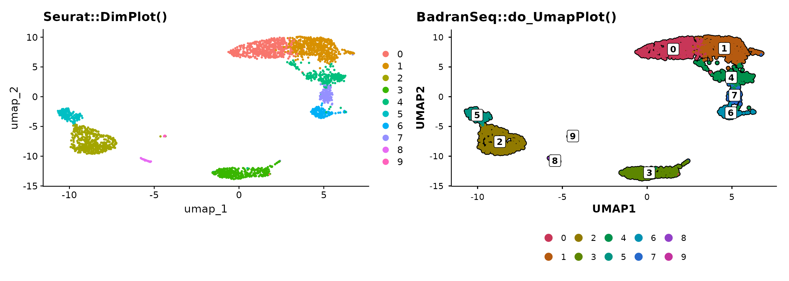

BadranSeq adds cell borders, boxed cluster labels, and a clean theme
automatically. No
[`theme()`](https://ggplot2.tidyverse.org/reference/theme.html) calls
needed.

## UMAP plots

[`do_UmapPlot()`](https://wolf5996.github.io/BadranSeq/reference/do_UmapPlot.md)
is the workhorse for UMAP visualisation.

### Basic usage

``` r
do_UmapPlot(pbmc3k)
```

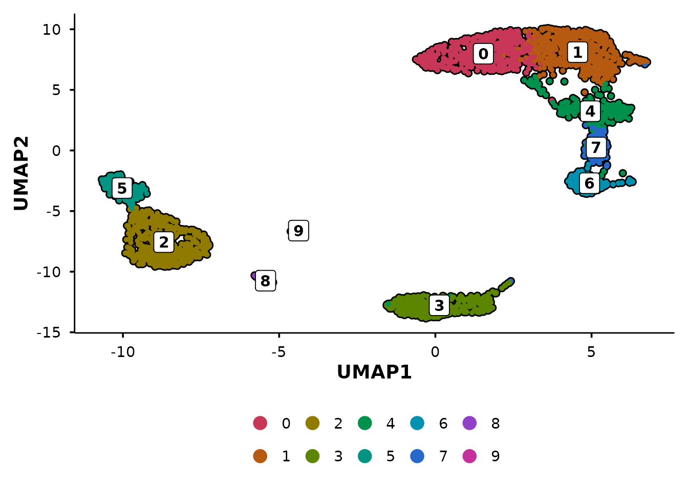

### Group by a metadata column

``` r
do_UmapPlot(pbmc3k, group.by = "seurat_annotations")
```

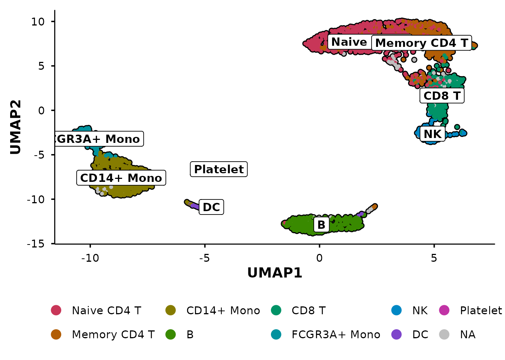

### Group by multiple metadata columns

Pass a vector of column names to create side-by-side panels:

``` r
do_UmapPlot(pbmc3k, group.by = c("seurat_clusters", "seurat_annotations"))
```

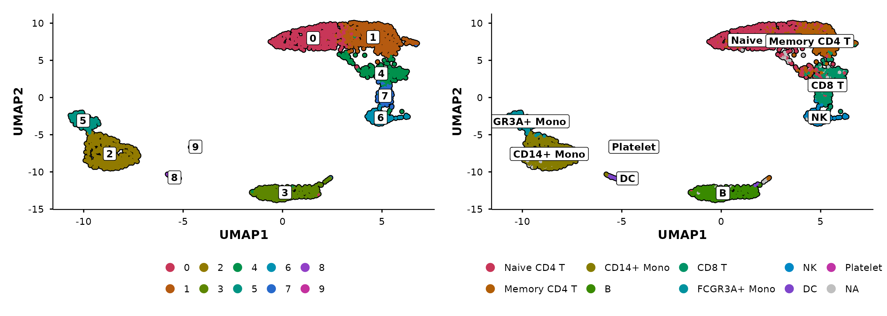

### Control panel layout

When combining multiple panels, use `ncol` and `nrow` to control the
patchwork layout. For example, stack the panels vertically with
`ncol = 1`:

``` r
do_UmapPlot(pbmc3k,
            group.by = c("seurat_clusters", "seurat_annotations"),
            ncol = 1)
```

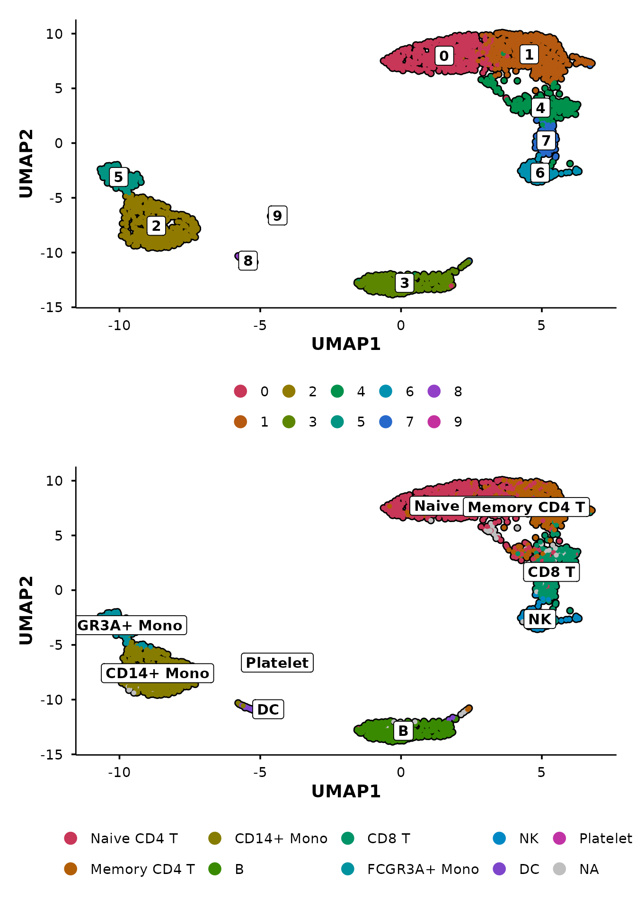

### Hide the legend

``` r
do_UmapPlot(pbmc3k, show.legend = FALSE)
```

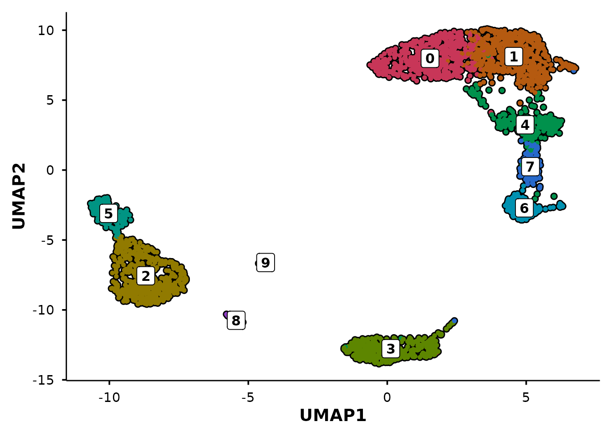

### Adjust point size and remove labels

``` r
do_UmapPlot(pbmc3k, pt.size = 0.3, label = FALSE)
```

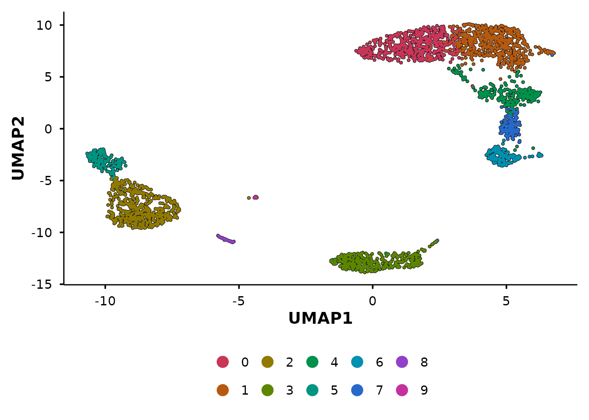

### Remove cell borders

``` r
do_UmapPlot(pbmc3k, plot_cell_borders = FALSE)
```

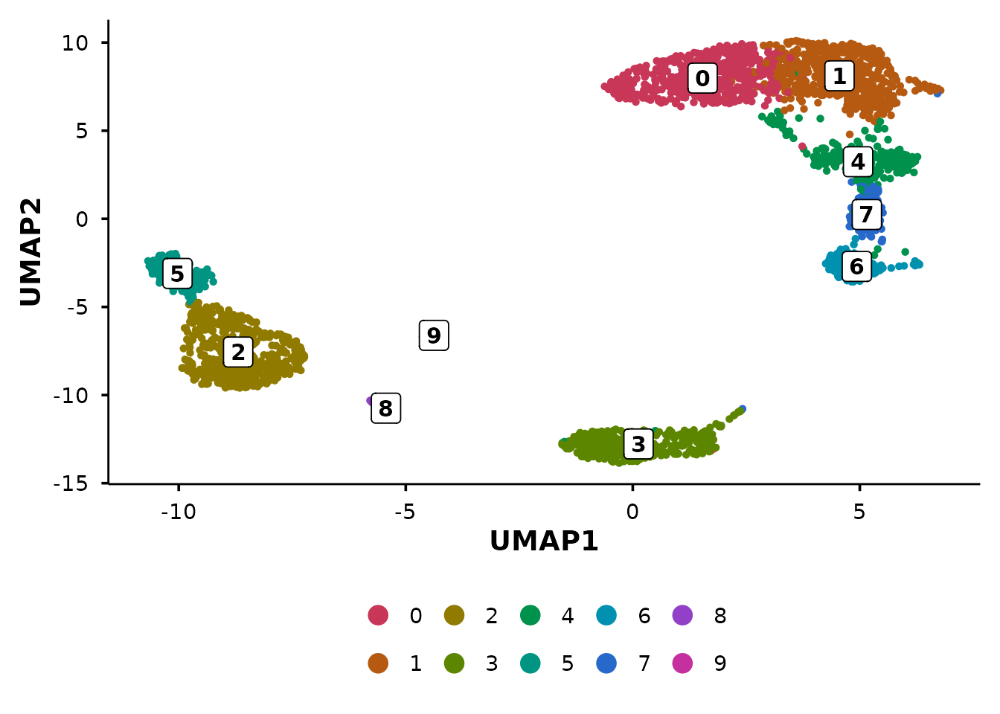

## PCA with automatic variance labels

[`do_PcaPlot()`](https://wolf5996.github.io/BadranSeq/reference/do_PcaPlot.md)
does what Seurat’s PCA plot does not — it calculates variance explained
per PC and formats the axis labels as “PC1 (X.X%)”.

``` r
p1 <- Seurat::DimPlot(pbmc3k, reduction = "pca") +
  ggtitle("Seurat::DimPlot(reduction = 'pca')")

p2 <- do_PcaPlot(pbmc3k) +
  ggtitle("BadranSeq::do_PcaPlot()")

p1 + p2
```

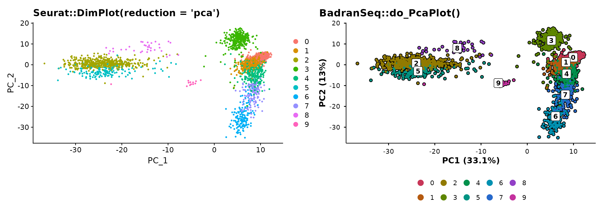

The variance annotation is automatic — no manual calculation or label
formatting required.

### Different dimension pairs

Explore PC2 vs PC3:

``` r
do_PcaPlot(pbmc3k, dims = c(2, 3))
```

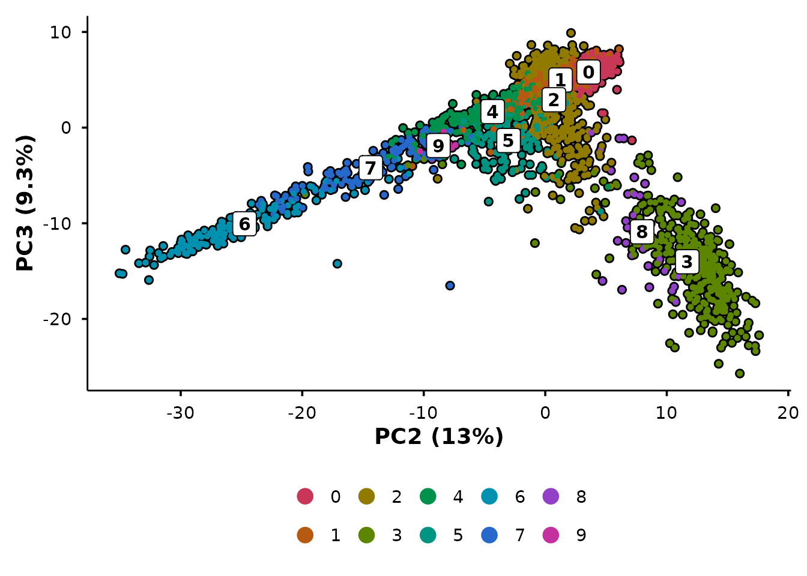

## The unified entry point

[`do_DimPlot()`](https://wolf5996.github.io/BadranSeq/reference/do_DimPlot.md)
routes to the appropriate handler based on the `reduction` argument:

| `reduction` | Routes to                                                                                             | Axis labels            |
|-------------|-------------------------------------------------------------------------------------------------------|------------------------|
| `"umap"`    | [`do_UmapPlot()`](https://wolf5996.github.io/BadranSeq/reference/do_UmapPlot.md)                      | UMAP1, UMAP2           |
| `"pca"`     | [`do_PcaPlot()`](https://wolf5996.github.io/BadranSeq/reference/do_PcaPlot.md)                        | PC1 (X.X%), PC2 (X.X%) |
| other       | [`.do_DimPlot_internal()`](https://wolf5996.github.io/BadranSeq/reference/dot-do_DimPlot_internal.md) | REDUCTION1, REDUCTION2 |

``` r
p1 <- do_DimPlot(pbmc3k, reduction = "umap") + ggtitle("reduction = 'umap'")
p2 <- do_DimPlot(pbmc3k, reduction = "pca") + ggtitle("reduction = 'pca'")

p1 + p2
```

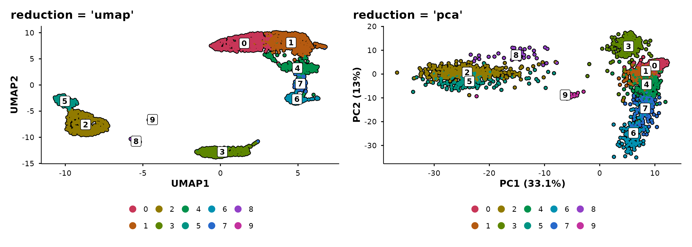

Use
[`do_DimPlot()`](https://wolf5996.github.io/BadranSeq/reference/do_DimPlot.md)
when writing general-purpose code that should work with any reduction.
Use the specific functions
([`do_UmapPlot()`](https://wolf5996.github.io/BadranSeq/reference/do_UmapPlot.md),
[`do_PcaPlot()`](https://wolf5996.github.io/BadranSeq/reference/do_PcaPlot.md))
when you know the reduction type.

## Feature expression plots

[`do_FeaturePlot()`](https://wolf5996.github.io/BadranSeq/reference/do_FeaturePlot.md)
overlays gene expression on the embedding using a viridis colour scale.

``` r
do_FeaturePlot(pbmc3k, features = c("CD3D", "CD14", "MS4A1"))
```

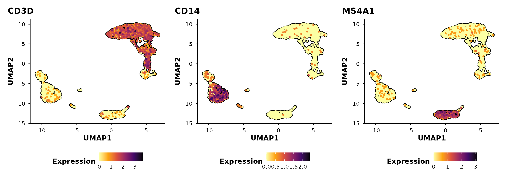

Cells are ordered by expression by default (`order = TRUE`), so
high-expressing cells are plotted on top — avoiding the common problem
of rare populations being hidden beneath low-expressing cells.

### Control panel layout

Use `ncol` and `nrow` to arrange multi-feature panels. For example,
stack them vertically:

``` r
do_FeaturePlot(pbmc3k,
               features = c("CD3D", "CD14", "MS4A1"),
               ncol = 1)
```

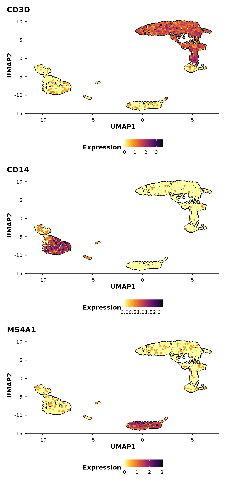

## Split-panel silhouettes

This is BadranSeq’s signature visualisation feature. When you pass
`split.by`, each panel shows:

1.  A **grey silhouette** of all cells (spatial context)
2.  **Black borders** on all cells
3.  **Coloured cells** only for the current split category

This preserves the spatial layout across panels, making it easy to see
where a subpopulation sits relative to the full dataset.

First, add a synthetic condition to demonstrate:

``` r
set.seed(42)
pbmc3k$condition <- sample(
  c("Control", "Treatment"),
  ncol(pbmc3k),
  replace = TRUE
)
```

Now compare Seurat’s default split with BadranSeq’s silhouette approach:

``` r
p1 <- Seurat::DimPlot(pbmc3k, reduction = "umap", split.by = "condition") +
  ggtitle("Seurat::DimPlot(split.by)")

p1
```

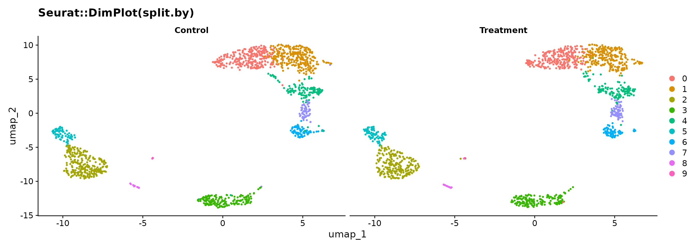

``` r
do_UmapPlot(pbmc3k, split.by = "condition")
```

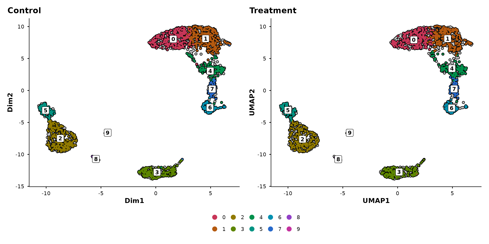

In the Seurat version, each panel only shows its own cells — you lose
the sense of where those cells sit in the overall structure. In
BadranSeq’s version, the grey background preserves this context: you can
immediately see which clusters are enriched in each condition.

The silhouette approach works with any grouping:

``` r
do_UmapPlot(pbmc3k, group.by = "seurat_annotations", split.by = "condition")
```

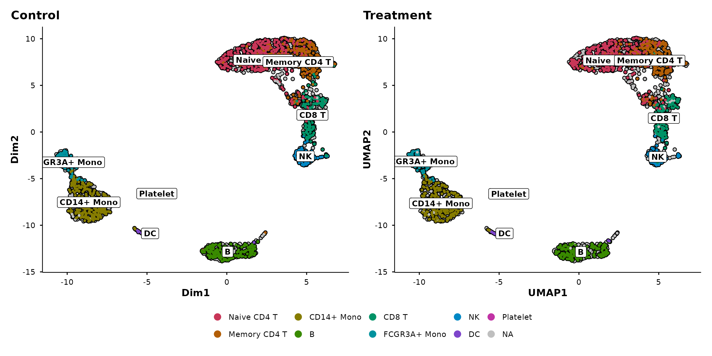

## Violin plots

BadranSeq provides two violin plot functions built on
[`fetch_feature_data()`](https://wolf5996.github.io/BadranSeq/reference/fetch_feature_data.md):

- **[`do_StatsViolinPlot()`](https://wolf5996.github.io/BadranSeq/reference/do_StatsViolinPlot.md)**
  — wraps
  [`ggstatsplot::ggbetweenstats()`](https://indrajeetpatil.github.io/ggstatsplot/reference/ggbetweenstats.html)
  for between-group comparisons with built-in statistical testing.
- **[`do_ViolinPlot()`](https://wolf5996.github.io/BadranSeq/reference/do_ViolinPlot.md)**
  — a pure ggplot2 violin with boxplot overlay, jittered points, and
  centrality markers (no statistical testing).

The primary function is
[`do_StatsViolinPlot()`](https://wolf5996.github.io/BadranSeq/reference/do_StatsViolinPlot.md).
If you want the same aesthetic without statistics, use
[`do_ViolinPlot()`](https://wolf5996.github.io/BadranSeq/reference/do_ViolinPlot.md)
or set `pairwise.display = "none"` in
[`do_StatsViolinPlot()`](https://wolf5996.github.io/BadranSeq/reference/do_StatsViolinPlot.md).

### Statistical violin plots

[`do_StatsViolinPlot()`](https://wolf5996.github.io/BadranSeq/reference/do_StatsViolinPlot.md)
runs a nonparametric omnibus test (Kruskal–Wallis) and pairwise
comparisons (Dunn’s test) by default, annotating the plot with p-values:

``` r
do_StatsViolinPlot(pbmc3k, features = "CD3D",
                   group.by = "seurat_annotations",
                   pairwise.display = "none")
```

    ## Warning: ✖ Number of labels is greater than default palette color count.
    ## ℹ Select another color `palette` (and/or `package`).

    ## Scale for colour is already present.
    ## Adding another scale for colour, which will replace the existing scale.

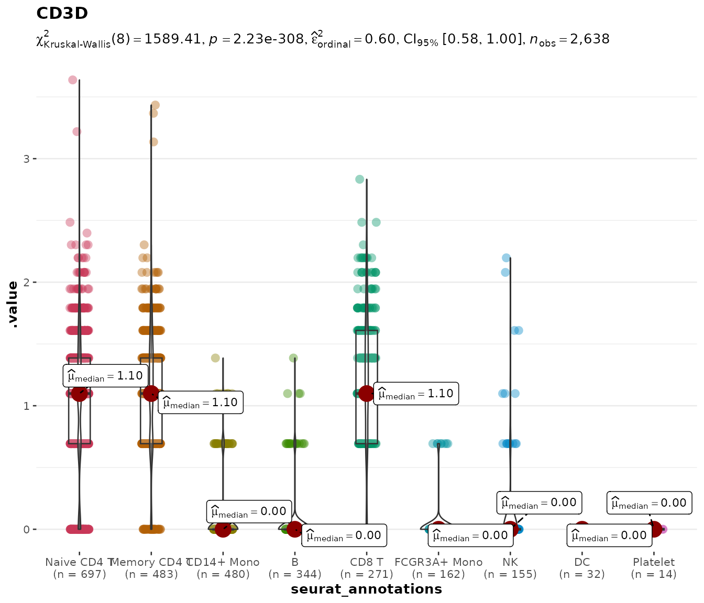

With nine annotation groups, pairwise brackets would overwhelm the
figure. The `pairwise.display` argument controls this:

### Controlling pairwise comparisons

| Value               | Behaviour                        |
|---------------------|----------------------------------|
| `"significant"`     | Only significant pairs (default) |
| `"non-significant"` | Only non-significant pairs       |
| `"all"`             | Every pairwise comparison        |
| `"none"`            | Omnibus test only, no brackets   |

Setting `pairwise.display = "none"` keeps the subtitle showing the
overall test statistic while removing all bracket annotations — useful
for publication figures where the brackets would overlap.

### Comparing specific groups with `group.levels`

Often you do not want to compare all cell types — perhaps only a few are
biologically relevant. The `group.levels` argument filters the grouping
variable to a specified subset *before* the statistical test is run, so
the test is performed only on the groups you care about.

With fewer groups, pairwise brackets become readable again:

``` r
do_StatsViolinPlot(pbmc3k, features = "CD3D",
                   group.by = "seurat_annotations",
                   group.levels = c("Naive CD4 T", "Memory CD4 T", "CD8 T"))
```

    ## Scale for colour is already present.
    ## Adding another scale for colour, which will replace the existing scale.

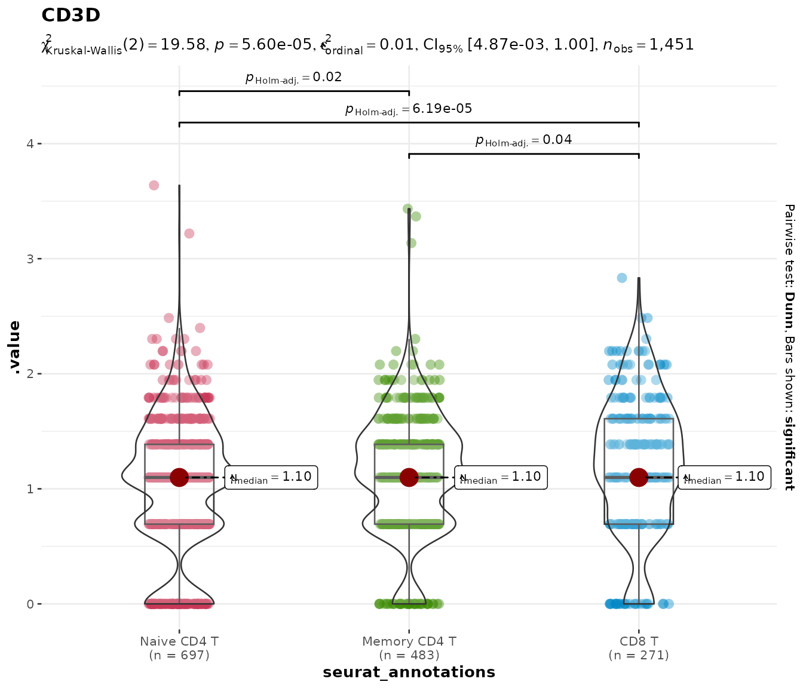

This is cleaner than subsetting the Seurat object manually and avoids
the need to drop unused factor levels.

### Parametric and Bayesian alternatives

The default nonparametric test is appropriate for most scRNA-seq data,
but you can switch to parametric (ANOVA / *t*-test), robust, or Bayesian
tests via the `type` argument:

``` r
do_StatsViolinPlot(pbmc3k, features = "CD3D",
                   group.by = "seurat_annotations",
                   group.levels = c("Naive CD4 T", "Memory CD4 T", "CD8 T"),
                   type = "parametric")
```

    ## Scale for colour is already present.
    ## Adding another scale for colour, which will replace the existing scale.

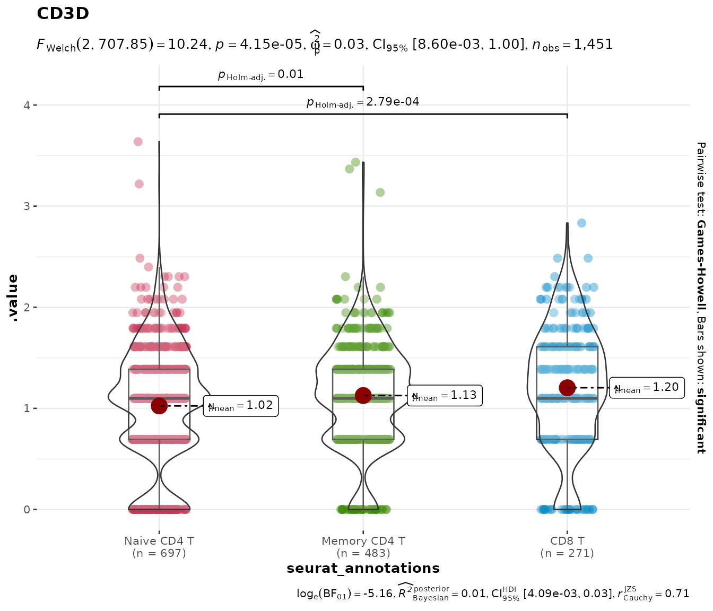

### Multiple genes

Pass a vector of gene names to get a combined patchwork layout:

``` r
do_StatsViolinPlot(pbmc3k,
                   features = c("CD3D", "CD8A"),
                   group.by = "seurat_annotations",
                   pairwise.display = "none",
                   ncol = 2)
```

    ## Warning: ✖ Number of labels is greater than default palette color count.
    ## ℹ Select another color `palette` (and/or `package`).

    ## Scale for colour is already present.
    ## Adding another scale for colour, which will replace the existing scale.

    ## Warning: ✖ Number of labels is greater than default palette color count.
    ## ℹ Select another color `palette` (and/or `package`).

    ## Scale for colour is already present.
    ## Adding another scale for colour, which will replace the existing scale.

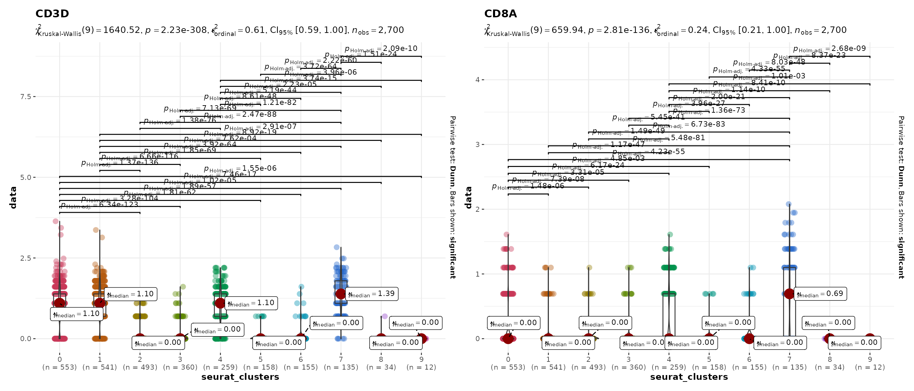

### Plain violin plots

[`do_ViolinPlot()`](https://wolf5996.github.io/BadranSeq/reference/do_ViolinPlot.md)
produces a violin + boxplot + jitter + centrality marker (median
diamond) without any statistical annotation. Use this when you want a
clean descriptive plot:

``` r
do_ViolinPlot(pbmc3k, features = "CD3D",
              group.by = "seurat_annotations")
```

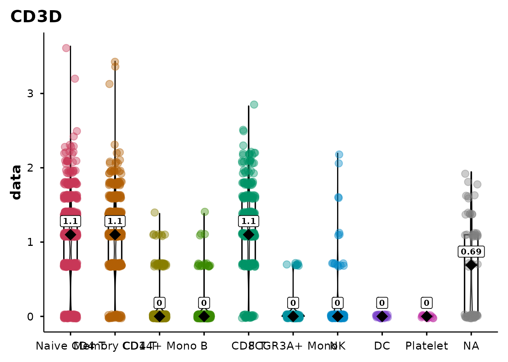

## Sankey / alluvial diagrams

[`do_SankeyPlot()`](https://wolf5996.github.io/BadranSeq/reference/do_SankeyPlot.md)
visualises relationships between categorical metadata variables using an
alluvial (Sankey) diagram. Each stratum is labelled and coloured; flows
connect cells across variables.

### Clusters to cell types

A common use case — mapping cluster IDs to biological annotations:

``` r
do_SankeyPlot(pbmc3k,
              columns = c("seurat_clusters", "seurat_annotations"))
```

    ## 62 cell(s) with NA values excluded from plot.

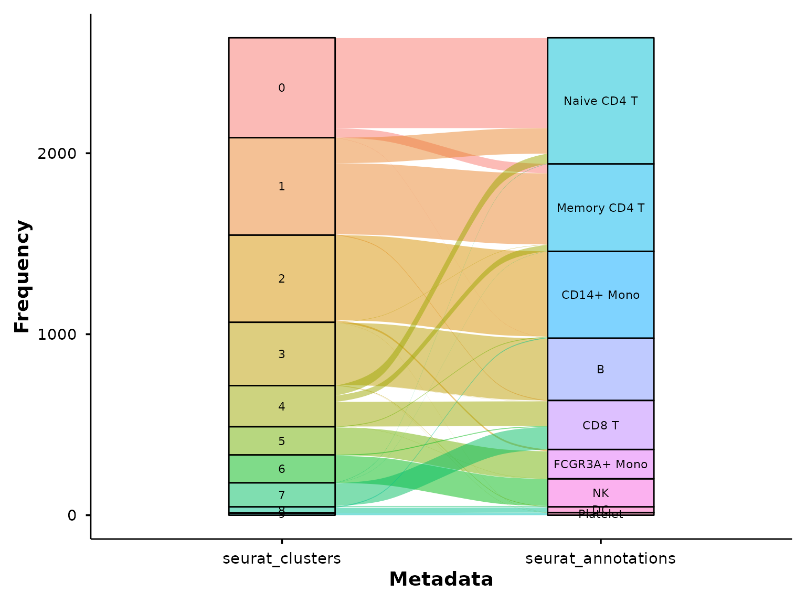

This immediately shows which clusters map cleanly to a single cell type
and which are split across multiple annotations.
