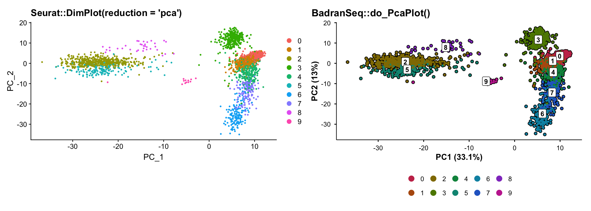
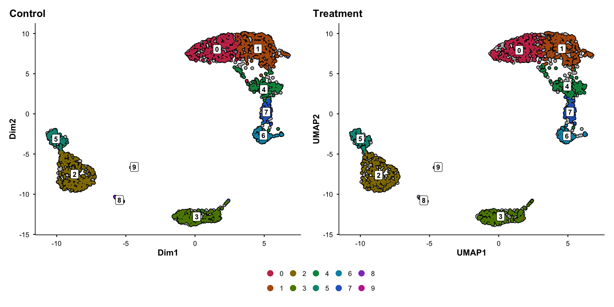

# BadranSeq

**BadranSeq** is an R package that produces publication-ready figures
from Seurat objects without additional styling. Built on native ggplot2,
it closes the gap between exploratory analysis and manuscript-quality
visualisation that Seurat’s defaults leave open.

## The problem

Seurat’s plotting functions are designed for exploration, not
publication. Every project ends with the same boilerplate: computing and
formatting PCA variance labels, adding cell borders, styling themes,
building split-panel comparisons that preserve spatial context, and
wiring up statistical annotations on violin plots. This work is repeated
across every analysis, every manuscript, and every lab.

## How BadranSeq solves it

| Feature                     |              Seurat              |                   BadranSeq                   |
|-----------------------------|:--------------------------------:|:---------------------------------------------:|
| PCA variance labels on axes |                No                |                 **Automatic**                 |
| Cell borders                |                No                |               **On by default**               |
| Cluster labels              |          Off by default          |               **On by default**               |
| Split-panel silhouettes     | No — facets lose spatial context |     **Grey silhouette preserves context**     |
| Statistical violin plots    |           Not built-in           | **Kruskal–Wallis + pairwise via ggstatsplot** |
| Viridis feature plots       |                No                |                  **Default**                  |
| Interactive cell selection  |     Limited (`CellSelector`)     |   **Additive/subtractive brush selection**    |
| Publication theme           |                No                |       **Consistent across all outputs**       |
| Automatic rasterisation     |                No                |        **\>50k cells auto-rasterised**        |

## Visual comparison

The figures below are generated with default settings — no theme
adjustments, no manual annotations.

``` r
library(BadranSeq)
library(Seurat)
library(ggplot2)
library(patchwork)
data(pbmc3k)

p1 <- DimPlot(pbmc3k, reduction = "umap") + ggtitle("Seurat::DimPlot()")
p2 <- do_UmapPlot(pbmc3k) + ggtitle("BadranSeq::do_UmapPlot()")
p1 + p2
```


BadranSeq adds cell borders, boxed cluster labels, a vivid colour
palette, and a clean theme — all with one function call.

### PCA with automatic variance annotation

``` r
p1 <- DimPlot(pbmc3k, reduction = "pca") + ggtitle("Seurat::DimPlot(reduction = 'pca')")
p2 <- do_PcaPlot(pbmc3k) + ggtitle("BadranSeq::do_PcaPlot()")
p1 + p2
```



Seurat’s PCA plot shows “PC_1” and “PC_2” with no indication of how much
variance each component explains. BadranSeq computes and formats this
automatically.

### Split-panel silhouettes

When comparing conditions, Seurat’s `split.by` facets each panel
independently — you cannot see where a subpopulation sits relative to
the full dataset. BadranSeq renders all cells as a grey silhouette in
every panel, overlaying only the current category in colour:

``` r
do_UmapPlot(pbmc3k, split.by = "condition")
```



### Statistical violin plots

[`do_StatsViolinPlot()`](https://wolf5996.github.io/BadranSeq/reference/do_StatsViolinPlot.md)
wraps
[`ggstatsplot::ggbetweenstats()`](https://indrajeetpatil.github.io/ggstatsplot/reference/ggbetweenstats.html)
with Seurat-aware data extraction, automatic colour generation, and a
`group.levels` argument for comparing specific clusters:

``` r
do_StatsViolinPlot(pbmc3k, features = "CD3D",
                   group.by = "seurat_clusters",
                   group.levels = c("0", "1", "4"))
```


Set `pairwise.display = "none"` to keep the omnibus test subtitle
without bracket clutter.

## Installation

``` r
# pak (recommended)
pak::pkg_install("wolf5996/BadranSeq")

# devtools
devtools::install_github("wolf5996/BadranSeq")
```

## Function reference

| Function                                                                                                     | Purpose                                          |
|--------------------------------------------------------------------------------------------------------------|--------------------------------------------------|
| [`do_UmapPlot()`](https://wolf5996.github.io/BadranSeq/reference/do_UmapPlot.md)                             | UMAP with borders, labels, silhouette split      |
| [`do_PcaPlot()`](https://wolf5996.github.io/BadranSeq/reference/do_PcaPlot.md)                               | PCA with automatic variance labels               |
| [`do_DimPlot()`](https://wolf5996.github.io/BadranSeq/reference/do_DimPlot.md)                               | Unified entry point (routes to UMAP/PCA handler) |
| [`do_FeaturePlot()`](https://wolf5996.github.io/BadranSeq/reference/do_FeaturePlot.md)                       | Gene expression overlay with viridis scale       |
| [`do_StatsViolinPlot()`](https://wolf5996.github.io/BadranSeq/reference/do_StatsViolinPlot.md)               | Statistical violin via ggbetweenstats            |
| [`do_ViolinPlot()`](https://wolf5996.github.io/BadranSeq/reference/do_ViolinPlot.md)                         | Descriptive violin (no statistics)               |
| [`EnhancedElbowPlot()`](https://wolf5996.github.io/BadranSeq/reference/EnhancedElbowPlot.md)                 | Variance-explained elbow plot with cutoff        |
| [`get_pca_variance()`](https://wolf5996.github.io/BadranSeq/reference/get_pca_variance.md)                   | Extract PCA variance as a data.frame             |
| [`select_cells_interactive()`](https://wolf5996.github.io/BadranSeq/reference/select_cells_interactive.md)   | Shiny brush selection of cells                   |
| [`seurat_sleepwalk()`](https://wolf5996.github.io/BadranSeq/reference/seurat_sleepwalk.md)                   | Interactive embedding distance explorer          |
| [`fetch_feature_data()`](https://wolf5996.github.io/BadranSeq/reference/fetch_feature_data.md)               | Tidy long-format extraction from Seurat          |
| [`theme_badranseq()`](https://wolf5996.github.io/BadranSeq/reference/theme_badranseq.md)                     | Publication theme for any ggplot                 |
| [`generate_badranseq_colors()`](https://wolf5996.github.io/BadranSeq/reference/generate_badranseq_colors.md) | Vivid categorical colour palette                 |

Full documentation and worked examples: **[pkgdown
site](https://wolf5996.github.io/BadranSeq/)**

## Dependencies

**Core** (automatically installed): ggplot2, Seurat, colorspace, dplyr,
tidyr, tibble, purrr, rlang, magrittr, SeuratObject, shiny, sleepwalk,
stats.

**Optional** (install for extended features): patchwork (multi-panel
layouts), ggrastr (rasterisation), ggstatsplot (statistical violin
plots).

## Acknowledgements

BadranSeq’s aesthetic design is inspired by
[SCpubr](https://github.com/enblacar/SCpubr) by Enrique Blanco Carmona.
Key elements adapted from SCpubr include cell border rendering, colour
palette generation, and the silhouette split approach. BadranSeq differs
by providing a lighter-weight native ggplot2 implementation with
additional features (PCA variance labels, statistical violin plots,
interactive cell selection).

## Citation

If you use BadranSeq in published work, please cite:

> Elshenawy, B. (2025). BadranSeq: Publication-ready visualisation for
> single-cell RNA sequencing data in R. R package version 1.0.0.
> <https://github.com/wolf5996/BadranSeq>

## License

MIT
